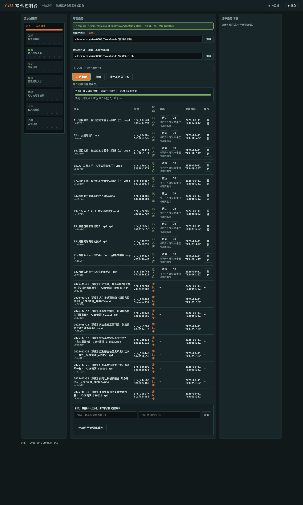

# Video2Obsidian — Turn Local Videos into Obsidian Notes

> Drop videos into a folder and get text notes as Markdown, all on your local Mac.

[简体中文](./README.md) | English



## What is this?

Video2Obsidian watches a video folder on your Mac, transcribes new videos locally, fixes known wrong words, splits the text into readable paragraphs, and saves the result as Markdown.

If you provide an Obsidian vault directory, notes are written there mirroring the video folder structure. If you leave it empty, notes stay in the data directory and your existing vault is untouched. Source videos are archived separately. No cloud API calls are required, so there is no API cost.

## Key features

- **Watch-and-process**: fill in a video folder, press start, then drop files in. Jobs queue in the background; you do not need to keep watching the page.
- **Local transcription**: uses `mlx-whisper` in your local Python environment, with `ffmpeg` extracting audio first.
- **Word fixes**: maintain “wrong word → correct word” pairs (names, terms) in the console. New transcripts apply them automatically; existing results can be re-run.
- **Draft and publish**: transcripts become paragraph-style Markdown. With a vault directory set, files mirror into Obsidian; without it, the run stops at render (a deliberate `RENDER_ONLY` outcome).
- **Visible jobs with retry**: the job list shows Discover → Transcribe → Tidy → Draft → Publish progress. Failed jobs can be retried, previewed, and opened in Finder or Obsidian.

## Who is it for?

- Obsidian users with course recordings, meeting recordings, or interview footage to turn into text.
- People who prefer to keep video and text on their own machine instead of uploading to a cloud service.
- Users on Apple Silicon Mac who can prepare the required Python transcription environment.

## Quick start

Run from the repository root:

```bash
./app/start.sh
```

The browser opens automatically at:

```text
http://127.0.0.1:8765/
```

Then, in order:

1. Fill in the **video folder** (required, absolute local path).
2. Fill in the **vault directory** (optional; transcription still works when empty).
3. Press **Start watching**, then copy video files into the video folder.

Click a row in the job list to read the finished note.

## Installation

### Requirements

- Apple Silicon Mac.
- Python 3.12 with `import mlx_whisper` working.
- `ffmpeg` installed locally (used to extract audio before transcription).
- An Obsidian vault directory is optional.

The console backend itself uses only the Python standard library, so it needs no extra `pip install`. Transcription depends on a virtualenv you have already prepared.

### How startup works

`start.sh` picks Python in this order:

```text
stage0bench/bin/python -> .venv/bin/python -> venv/bin/python -> python3
```

- With `mlx_whisper`: transcription is available.
- Without it: the console still opens, but starting a job returns `400 PRECHECK_MLX_MISSING`. Switch to the right Python and restart.

The port is fixed at `127.0.0.1:8765` and only listens locally.

## Usage

### Minimal path

```bash
./app/start.sh
# Open http://127.0.0.1:8765/
# Fill video folder -> Start watching -> Drop videos in -> Check the job list
```

Accepted input suffixes (as implemented in the console): `.mp4` `.mov` `.mkv` `.m4a` `.mp3` `.wav`.

### Word fixes

Add one “wrong → correct” pair in the vocabulary area to affect new transcripts. Re-run existing results to apply updated pairs.

See [Usage](./docs/usage.md) for details.

## Configuration

| Field in the page | Required | Notes |
| --- | --- | --- |
| Video folder | Yes | Absolute local path to watch. Pasted quoted paths have quotes stripped automatically. |
| Vault directory | No | When empty, notes stay in the data directory and Obsidian is untouched. |
| Data directory | No | Advanced. Defaults under the OS temp directory (e.g. `/tmp/v2o-console-data`) so test runs do not pollute a real vault. |

For full behavior see [Usage](./docs/usage.md); for errors see [Troubleshooting](./docs/troubleshooting.md).

## Documentation

- [Usage](./docs/usage.md)
- [Troubleshooting](./docs/troubleshooting.md)

`docs/pm/`, `docs/review/`, `docs/qa/`, and `docs/handoff/` hold development plans, reviews, test reports, and handoffs. Regular users can ignore them.

## Known limitations

- The target device is Apple Silicon Mac. Other platforms are not verified in this repository.
- Without `mlx_whisper` or `ffmpeg`, transcription is unavailable; the console reports it explicitly.
- Watch state is lost on restart; press start again in the page after the service restarts.
- Long real-world videos are still under acceptance testing. The pipeline guarantees it keeps running, not word-level accuracy.
- There is no License file in the repository. Treat it as all rights reserved until a license is added.

## License

No License file is provided yet. Add one before public distribution and link it here.
